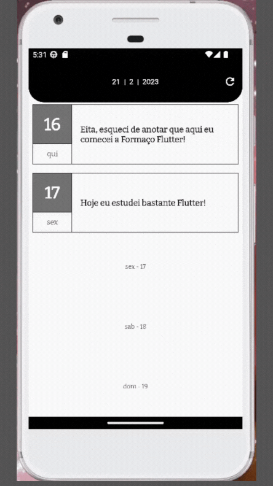

<h1 align="center">
    <strong>Simple Journal Alura - Flutter Formation</strong>
</h1>

## 🔨 Projeto: Simple Journal

O código de Flutter: Web API - Integrando sua Aplicação são **Classes** e **Funções** para gerar uma aplicação de um **Diário pessoal**, que **registra entradas diárias** da pessoa usuária do aplicativo.

<p align="center">
    <span align="center">
      
    </span>
</p>

## 🛠️ Abrir e rodar o projeto

**Para executar este projeto você precisa:**

Clone o projeto e acesse a pasta do mesmo.

```bash
$ git clone https://github.com/erikbernard/simple-journal-alura-flutter-formation.git
$ cd simple-journal-alura-flutter-formation
```

- Ter uma IDE, que pode ser o [Android Studio](https://developer.android.com/) instalado na sua máquina;
- Ter a [SDK do Flutter](https://docs.flutter.dev/get-started/install) na versão 3.0.0;
- Ter o [Node.JS](https://nodejs.org/en/) instalado na sua máquina;
- (A partir da branch "Aula 02") Ter um servidor [JSON-Server](https://www.npmjs.com/package/json-server) rodando o arquivo [server/db.json] em um endereço visível ao emulador usado;

## 📚 Mais informações do curso

Gostou do projeto e quer conhecer mais? Você pode [acessar o curso](https://cursos.alura.com.br/course/flutter-webapi-integrando-aplicacao) que desenvolve o projeto desde o começo! Nele você aprenderá:

- O que é uma Web API;
- Configurar uma API Local;
- Configurar um projeto Flutter para fazer requisições para APIs;
- O que é e como usar REST e JSON;
- Métodos do HTTP como GET e POST;

Esse curso faz parte da [formação de Flutter da Alura](https://cursos.alura.com.br/formacao-flutter)

_Te vejo lá!_
